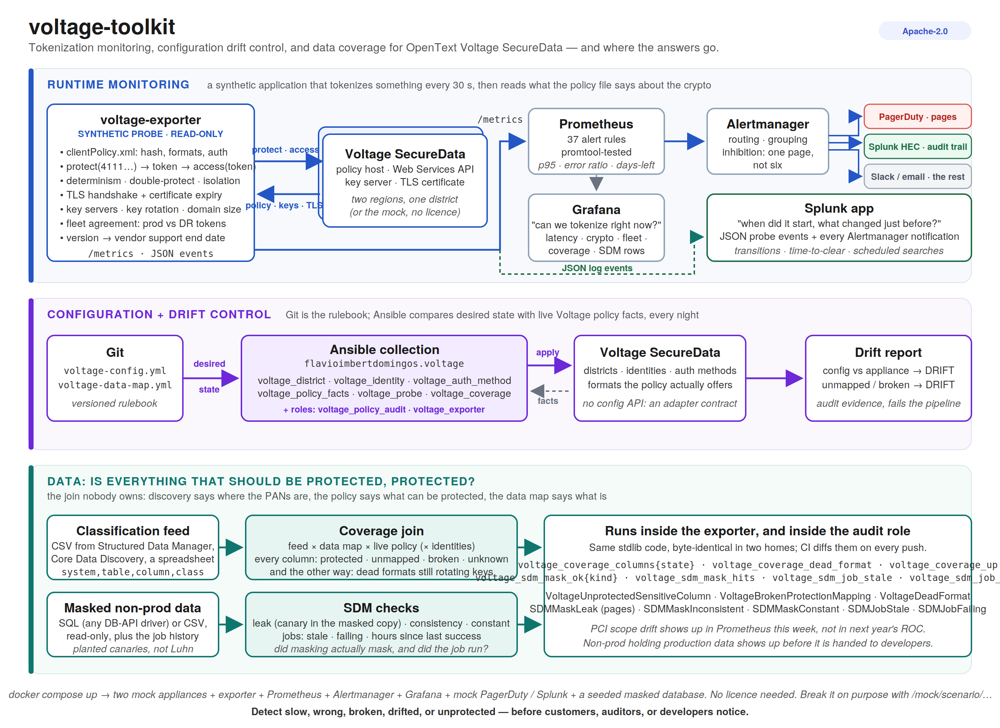
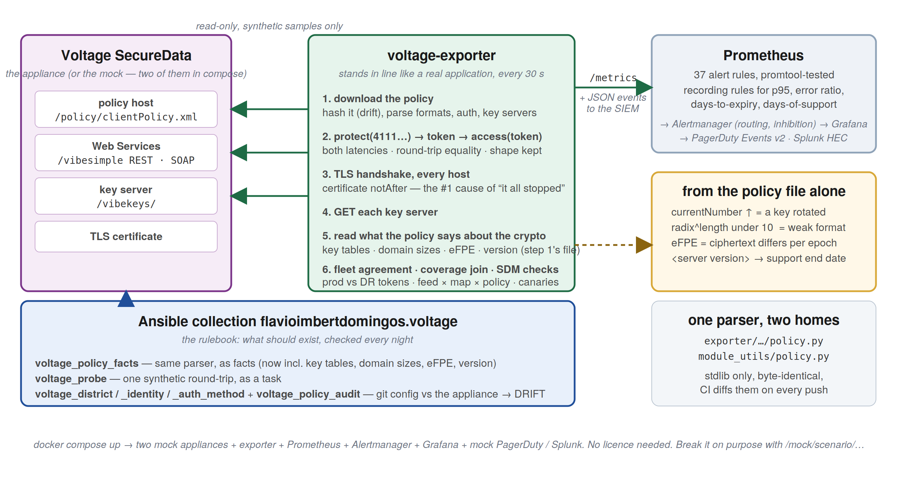

# voltage-toolkit

**Monitoring and automation for OpenText Voltage SecureData — the tokenization service nobody
can see inside.**

Two things in one repo:

1. **`voltage-exporter`** — a Prometheus exporter that *actually tokenizes something* every
   30 seconds and reports latency, error rate, data integrity, policy drift and certificate expiry —
   and reads what the policy file says about the crypto itself: key rotation, formats whose domain
   is too small to be safe, eFPE, and how long the appliance version stays in support.
2. **`flavioimbertdomingos.voltage`** — an Ansible collection: policy facts, a synthetic-probe
   module, config-as-code for identities / districts / auth methods with drift detection, and a
   role that deploys the exporter.

Plus a mock appliance, so all of it runs with `docker compose up` and no Voltage licence.




[](https://github.com/FlavioImbertDomingos/voltage-toolkit/actions/workflows/ci.yml)
[](LICENSE)

---

## Non-techinical explanation

A bank has a machine that turns card numbers into fake-looking card numbers (a *token*) so
the real ones never sit in databases. Every payment, every night batch, every customer
lookup asks that machine: "tokenize this", "un-tokenize that". That machine is
**Voltage SecureData**.

Here's the problem: the machine's own dashboard tells you it's *switched on*. It does not
tell you whether an application, right now, can get a token back in under half a second,
whether the token can be turned back into the right card number, or whether the certificate
every application checks expires on Tuesday.

**voltage-exporter is a robot that stands in line like a real application.** Every 30 seconds
it hands the machine a fake card number, gets a token, hands the token back, and checks it got
the same fake number. It times both steps and writes the results on a whiteboard for
Prometheus. If anything is slow, wrong or broken, an alert fires before customers notice.

It also asks the trick questions a customer never would: *does the same card number always get
the same token?* (if not, every report that joins two tables silently loses rows), *if I hand a
card-number token to the social-security window, do I get the card number back?* (if so, the
windows share a key and anyone with one badge can read everything), and *if I tokenize a token,
can I still get back to where I was?* The machine says "OK" to all of these even when the answer
is wrong. Only a robot that checks would know.

When the bank makes a *copy* of its data for developers to test with — with every card number
supposedly replaced — the robot checks the copy. It looks for a few fake customers that were
planted in the real data specifically so they could be searched for later: if one turns up in
the copy, the replacing skipped a row. It checks that the same customer's card number was
replaced the same way in every table, or the test copy quietly loses rows on every join. And it
checks that the nightly job that does the replacing actually ran, because those jobs fail
without telling anyone.

It also reads two lists nobody usually puts side by side: the list of columns the discovery
tool says hold card numbers, and the list of columns somebody wrote down as "tokenized by
Voltage, using this format, by that application". A column on the first list and not the
second is exactly what an auditor finds a year later. The robot finds it in thirty minutes.

And when there are two machines — one in each data centre, meant to be identical — the robot
asks both the same question and compares the answers. If the backup machine gives a *different*
token for the same card number, nobody finds out until the day the main one fails and every
new token it writes is one the old data can't be matched against. The robot finds out on a
Tuesday afternoon instead.

**The Ansible collection is the rulebook.** It writes down, in git, which districts should
exist, which formats they offer, which applications (identities) may use them and how they
log in — and every night it checks the machine still agrees with the rulebook.

**The machine also publishes its own rulebook page** — the policy file every application
downloads before it can do anything. That page says which key is the current one, how each
format is shaped, and what version the machine is running. The robot reads it too. So if a key
quietly rotates, if a format only has a hundred thousand possible values (too few to be safe),
or if the machine's version is about to fall out of the vendor's support, an alert says so —
without ever asking the machine to encrypt anything.




---

## Try it in 3 minutes (no Voltage needed)

```bash
git clone https://github.com/FlavioImbertDomingos/voltage-toolkit.git
cd voltage-toolkit
docker compose up -d
```

| What | Where |
|---|---|
| Grafana dashboard | http://localhost:3000 (admin / admin) |
| Prometheus alerts | http://localhost:9090/alerts |
| Raw metrics | http://localhost:9743/metrics |
| The mock appliance's policy | https://localhost:8443/policy/clientPolicy.xml |
| Masked non-prod database (sqlite, read-only) | seeded by `nonprod-seed` into the `nonprod-data` volume |
| The second region (same district) | https://localhost:8444/policy/clientPolicy.xml · scenarios on :8801 |
| What PagerDuty and Splunk received (mock) | http://localhost:8900/received?kind=pagerduty · `?kind=splunk` |

### Break it on purpose

```bash
curl -X POST localhost:8800/mock/scenario/slow            # p95 latency alert
curl -X POST localhost:8800/mock/scenario/errors          # error-rate alert
curl -X POST localhost:8800/mock/scenario/auth-fail       # auth-failure alert (rotated a secret?)
curl -X POST localhost:8800/mock/scenario/policy-down     # nothing can start: critical
curl -X POST localhost:8800/mock/scenario/keyserver-down  # key server alert
curl -X POST localhost:8800/mock/scenario/policy-changed  # drift: a format appeared
curl -X POST localhost:8800/mock/scenario/key-rotated     # key table PCI: currentNumber 4 -> 5
curl -X POST localhost:8800/mock/scenario/weak-key        # a 128-bit current key
curl -X POST localhost:8800/mock/scenario/format-leak     # a CC token detokenizes under SSN — round-trip stays green
curl -X POST localhost:8800/mock/scenario/nondeterministic # protect(x) != protect(x) — round-trip stays green
curl -X POST localhost:8801/mock/scenario/diverged-keys   # the DR region: same policy, different tokens — pages
curl -X POST localhost:8801/mock/scenario/key-rotated     # a rotation that reached DR only
curl -X POST localhost:8800/mock/scenario/healthy
```

Several findings are visible from the first scrape on purpose: the mock's HTTPS certificate is
valid for 20 days; its `SSN` format keeps the last 4 digits — which leaves a 10^5 domain, under
the 10^6 floor NIST SP 800-38G Rev. 1 requires for FF1; and the demo classification feed lists a
PAN column (`warehouse.dw.fact_orders.card_no`) that the data map does not cover; and the pretend
masked non-prod database has one customer row the masking job skipped, plus a masking job that
is stale and failing. All of them are true of real deployments more often than anyone likes.

### What the metrics look like

```
voltage_policy_up{target="demo-prod"} 1.0
voltage_policy_info{district="prod",policy_id="prod-2026-09",sha256="04315d3301d6",target="demo-prod",version="7.0.2"} 1.0
voltage_tokenize_success{format="CC",identity="probe@demo.bank",target="demo-prod"} 1.0
voltage_tokenize_roundtrip_ok{format="CC",target="demo-prod"} 1.0
voltage_protect_seconds_bucket{format="CC",le="0.1",target="demo-prod"} 41.0
voltage_tokenize_errors_total{format="CC",kind="auth",target="demo-prod"} 0.0
voltage_policy_changes_total{target="demo-prod"} 0.0
voltage_certificate_expiry_timestamp_seconds{host="voltage:8443",subject="CN=voltage:8443,O=Mock Voltage",target="demo-prod"} 1.79e+09
voltage_keyserver_up{target="demo-prod",url="https://voltage:8443/vibekeys/"} 1.0
voltage_key_table_current_number{table="PCI",target="demo-prod"} 4.0
voltage_format_domain_size{format="SSN",target="demo-prod"} 100000.0
voltage_format_below_minimum_domain{format="SSN",target="demo-prod"} 1.0
voltage_policy_format_efpe{format="CC-EFPE",target="demo-prod"} 1.0
voltage_appliance_version_info{major="7",minor="7.0",target="demo-prod",version="7.0.3.100100"} 1.0
```

### Try the Ansible side

```bash
pip install ansible-core
export ANSIBLE_COLLECTIONS_PATH=$PWD
ansible-playbook flavioimbertdomingos.voltage.configure                  # writes voltage-config.yml (config as code)
VOLTAGE_SHARED_SECRET=probe-secret ansible-playbook flavioimbertdomingos.voltage.probe -e voltage_validate_certs=false
ansible-playbook flavioimbertdomingos.voltage.audit -e voltage_audit_validate_certs=false \
    -e voltage_audit_config_path=$PWD/ansible_collections/flavioimbertdomingos/voltage/playbooks/voltage-config.yml
curl -X POST localhost:8800/mock/scenario/policy-changed && ansible-playbook flavioimbertdomingos.voltage.audit \
    -e voltage_audit_validate_certs=false -e voltage_audit_fail_on_drift=true ...   # → "DRIFT: PHONE not declared"
```

(Point `voltage_policy_url` at `https://localhost:8443/...` when running outside compose.)

---

## Point it at a real appliance

**Exporter:**

```bash
cp config/voltage-exporter.example.yml config/voltage-exporter.yml   # your districts + probe identity
cp .env.example .env                                                 # VOLTAGE_SHARED_SECRET_PROD=...
docker compose up -d voltage-exporter prometheus alertmanager grafana
```

You need: a **dedicated, low-privilege probe identity** allowed to use the formats you probe,
its shared secret (or an LDAP user), network access to the policy host and Web Services host,
and the CA that signed the appliance certificate. Use **synthetic samples only** (test PANs).
See [docs/REAL-VOLTAGE.md](docs/REAL-VOLTAGE.md).

**Ansible:** see the [collection README](ansible_collections/flavioimbertdomingos/voltage/README.md).

**PagerDuty and Splunk:** Alertmanager already routes to both (keys read from files); the exporter
logs one JSON event per target per cycle for the SIEM, and `splunk/` is an installable Splunk app
with the dashboard and scheduled searches. Grafana and Alertmanager stay as they are.
See [docs/INTEGRATIONS.md](docs/INTEGRATIONS.md).

---

## What you get

| Signal | Why it matters | Metric / rule |
|---|---|---|
| **Can apps tokenize right now?** | The only question that matters at 3 a.m. | `voltage_tokenize_success`<br>`VoltageTokenizationFailing` |
| **Is the data coming back right?** | A wrong detokenize silently corrupts data | `voltage_tokenize_roundtrip_ok`<br>`VoltageRoundTripMismatch` |
| **Did masking actually mask?** | A planted canary in non-prod, or joins that silently drop rows | `voltage_sdm_mask_ok{kind}`<br>`SDMMaskLeak`<br>`SDMMaskInconsistent` |
| **Did the archive / masking job run?** | Batch jobs fail quietly; the first symptom is a storage bill | `voltage_sdm_job_stale`<br>`SDMJobStale`<br>`SDMJobFailing` |
| **Is every sensitive column actually protected?** | Discovery says PAN, the data map says nothing — PCI scope drift, in Prometheus rather than next year's ROC | `voltage_coverage_columns{state}`<br>`VoltageUnprotectedSensitiveColumn`<br>`VoltageBrokenProtectionMapping` |
| **Would a failover work?** | Two regions, same policy, different tokens: every member round-trips fine alone | `voltage_fleet_agreement{check="token"}`<br>`VoltageRegionDivergence` |
| **Do all nodes serve the same policy?** | Propagation is lazy and per node | `voltage_fleet_agreement{check="policy"}`<br>`VoltagePolicyFleetDivergent` |
| **Is it *correct*, not just working?** | Formats sharing a key, non-deterministic protection, double-protect corruption — all return HTTP 200 | `voltage_integrity_ok{check}`<br>`VoltageFormatIsolationBroken`<br>`VoltageNonDeterministic`<br>`VoltageDoubleProtectCorrupts` |
| **How slow?** | Checkout latency budgets | `voltage_protect_seconds` histogram<br>`VoltageLatencyHigh` (p95) |
| **How often does it fail?** | Intermittent failures apps retry around | `voltage_tokenize_probes_total{result}`<br>`VoltageErrorRateHigh` |
| **Why did it fail?** | "Somebody rotated the shared secret" vs "the box is down" | `voltage_tokenize_errors_total{kind=auth\|http\|timeout\|connection\|mismatch}` |
| **Can new apps start?** | Every client downloads the policy at startup | `voltage_policy_up`<br>`VoltagePolicyUnreachable` |
| **Did someone change the config?** | PCI change control; drift | `voltage_policy_changes_total`<br>`VoltagePolicyChanged` |
| **Will TLS break on Tuesday?** | The #1 cause of "everything stopped" | `voltage_certificate_expiry_timestamp_seconds`<br>`VoltageCertificateExpiring*` |
| **Are key servers up?** | New identities and key rotation depend on them | `voltage_keyserver_up` |
| **Did a key rotate?** | The real rotation mechanism is `currentNumber` in the policy — now observable | `voltage_key_table_current_number`<br>`VoltageKeyRotated` |
| **Is a format too small to be safe?** | NIST's 10^6 floor for FF1; the appliance won't tell you | `voltage_format_domain_size`<br>`VoltageFormatBelowMinimumDomain` |
| **Which columns can't be joined?** | eFPE ciphertext differs per key epoch | `voltage_policy_format_efpe` |
| **Are we running out of support?** | The version is in the policy file; the dates are in the release notes | `voltage_appliance_version_info`<br>`voltage_support_end_timestamp_seconds` |

37 alert rules with runbook-style descriptions (unit-tested with promtool), Alertmanager
routing with inhibition and receivers for PagerDuty and Splunk, a Grafana dashboard, and JSON
probe events for a SIEM.

---

## Repository map

```
voltage-toolkit/
├── docker-compose.yml                  one command → mock + exporter + Prometheus + Alertmanager + Grafana
├── exporter/                           voltage-exporter (Python; pip-installable; Dockerfile; tests)
├── mock-voltage/                       pretend appliance: clientPolicy.xml, REST + SOAP WS API, key server, scenarios
├── mock-integrations/                  pretend PagerDuty Events v2 + Splunk HEC: records what Alertmanager delivered
├── ansible_collections/flavioimbertdomingos/voltage/
│   ├── plugins/modules/                voltage_policy_facts, voltage_probe, voltage_district, voltage_identity, voltage_auth_method
│   ├── plugins/module_utils/           policy parser (shared with the exporter), WS client, desired-state backends
│   ├── roles/                          voltage_policy_audit, voltage_exporter
│   ├── playbooks/                      configure, audit, probe, deploy_exporter, voltage-data-map.yml
│   ├── docs/ADAPTER.md                 the http / command adapter contract
│   └── tests/unit/                     modules run as Ansible runs them, against the mock
├── prometheus/                         config + 37 alert rules + promtool tests
├── alertmanager/ · grafana/            routing, inhibition, PagerDuty + Splunk receivers (secrets/ = demo keys), generated dashboard
├── splunk/voltage_toolkit/             installable Splunk app: props, macros, scheduled searches, the SIEM dashboard
├── demo/                               seed_nonprod.py + canaries.txt: the pretend masked non-prod database
└── docs/                               METRICS, ALERTS, COVERAGE, SDM, INTEGRATIONS, REAL-VOLTAGE, ARCHITECTURE, FAQ
```

## Status & honesty

- **Voltage SecureData has no public API documentation.** The policy URL pattern
  (`https://voltage-pp-0000.<domain>/policy/clientPolicy.xml`) and the SOAP Web Services
  endpoint (`/vibesimple/services/VibeSimpleSOAP`, `ProtectFormattedData` / `AccessFormattedData`)
  are taken from OpenText's public integration guides and Vertica's SecureData docs. The
  **REST** field names and paths, and the **policy XML element names**, are configurable and the
  parser is deliberately forgiving — because the real ones are behind a support login.
  **If you run Voltage, a redacted `clientPolicy.xml` and one REST request/response is the most
  useful issue you can open.**
- The mock's "FPE" is a toy substitution, not FF1. It preserves shape so the probes and the
  round-trip logic are exercised for real; it is not cryptography.
- The config modules manage a desired-state document and adapters, because OpenText publishes
  no configuration API for the Management Console. That is stated plainly in the collection
  README rather than pretended away.
- Read-only towards the appliance, always: the exporter and the modules only ever call the
  policy download and the protect/access operations you'd use from any application.

## Roadmap

Where this goes next — coverage metrics against a classification feed, key-rotation and
small-domain checks parsed straight from the policy, silent-corruption probes, and the
SDM / discovery seam nobody monitors: **[ROADMAP.md](ROADMAP.md)**.

## Sister projects

- [luna-exporter](https://github.com/FlavioImbertDomingos/luna-exporter) — Prometheus monitoring for Thales Luna HSMs
- [keycensus](https://github.com/FlavioImbertDomingos/keycensus) — cryptographic inventory / CBOM scanner (reads Voltage exports too)

## License

Apache-2.0, except the Ansible collection (`ansible_collections/…`), which is GPL-3.0-or-later as Ansible requires
for modules. Not affiliated with OpenText. "Voltage" and "SecureData" are trademarks of Open Text Corporation.
